# ITAM project

---

Как выглядит интерфейс можно посмотреть в директории [**imgs/**](./imgs/). 
Структура файлов в проекте расположена в [**readmeS/structure.md**](readmeS/structure.md). 

---


## 🛠 Технологический стек
- **Backend:** FastAPI (Python), SQLAlchemy (ORM), Alembic (миграции)
- **Frontend:** React (TypeScript), Ant Design (UI)
- **База данных:** SQLite
- **Авторизация:** JWT Bearer-токены, роли **Admin / Teacher / Student**
- **Ключевые модули:** Курсы, Уроки, Посещаемость, Фидбэк, Аналитика, Профиль
- **Аналитика с ML:** дашборд метрик + прогноз риска пропуска следующего занятия (ML-модель)
- **Экспорт/импорт:** выгрузка посещаемости в CSV/JSON с фильтрацией и предпросмотром; импорт (например, из CSV)
- **Запуск:** Docker (frontend + backend) или локально (Uvicorn + Vite dev server)
<p align="center">
  
  
  
  
  
  
  
  
  
  
</p>

---

## 🧭 Назначение системы
**ITAM** — административная панель для учебного процесса, которая объединяет в одном интерфейсе:
- управление курсами и занятиями;
- фиксацию и контроль посещаемости;
- сбор обратной связи;
- аналитические метрики и прогнозы;
- экспорт данных для отчётности.

Архитектурно система разделена на:
- **backend** (FastAPI), который реализует REST API, авторизацию, бизнес-логику и хранение данных в PostgreSQL.
- **frontend** (React + TypeScript + Ant Design), который отвечает за UI и взаимодействие с API;

Все ключевые функции доступны только **авторизованным пользователям** в **рамках их ролей**.

---

## 🔐 Авторизация и учётные записи
<p align="center">
  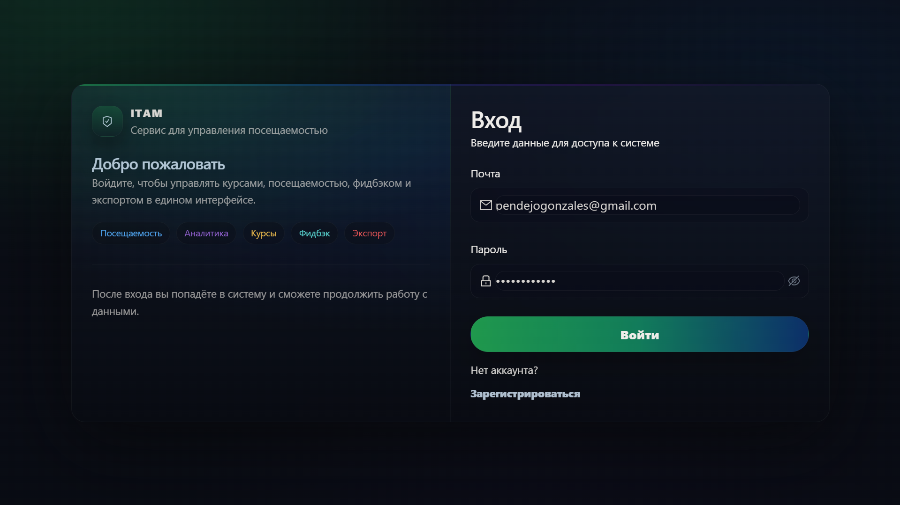
  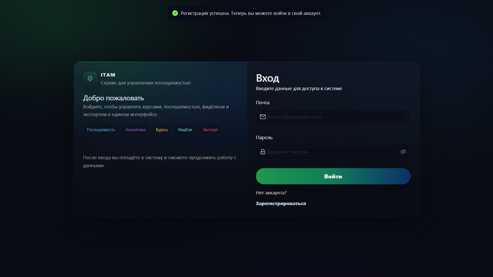
</p>

### 👥 Роли пользователей (RBAC)
В ITAM используется модель **Role-Based Access Control** с тремя базовыми ролями:

- **Admin (Администратор):** полный доступ ко всем разделам и операциям системы.
- **Teacher (Преподаватель):** доступ к рабочим разделам (например, Курсы, Уроки, Посещаемость) **в рамках закреплённых курсов**.
- **Student (Студент):** доступ к личным данным и просмотру своих записей (например, собственная посещаемость и фидбэк).

📌 Важно:
- **роль хранится на сервере** (в модели пользователя в БД);
- фронтенд может скрывать/показывать элементы UI по роли, но **решения о доступе принимает только бэкенд**;
- все защищённые операции контролируются проверками роли на уровне API.

---

### 🔑 Процесс входа (логин)
Логин в системе — это получение **access token** (JWT), который далее выступает «пропуском» к защищённым ресурсам.

Типовой поток:
1. Пользователь вводит **email и пароль** на странице входа и отправляет форму.
2. Фронтенд отправляет запрос на эндпоинт авторизации (API).
3. Бэкенд:
   - находит пользователя по email,
   - проверяет пароль (сравнение с хешем),
   - проверяет статус аккаунта (активен/неактивен),
   - при успехе генерирует **JWT-токен**.
4. Сервер возвращает токен в формате **Bearer**.
   - Пример заголовка: `Authorization: Bearer <token>`
5. Фронтенд сохраняет токен (например, в `localStorage`) и прикладывает его ко всем последующим запросам.

⚠️ Ошибки входа:
- `401 Unauthorized` / `403 Forbidden` — неверные данные или запрет по правам/статусу.
- Фронтенд должен показывать понятное уведомление об ошибке авторизации.

---

### 🧾 Регистрация нового пользователя
Для регистрации используется отдельная страница, которая отправляет запрос:
- `POST /api/v1/register`

На сервере выполняются:
- валидация данных,
- проверка уникальности email,
- хеширование пароля,
- создание пользователя в БД,
- назначение роли по умолчанию (обычно **student**).

---

### 👤 Получение текущего пользователя
После успешного логина (или при повторном открытии приложения) фронтенд выполняет запрос вида:
- `GET /api/v1/users/me`

Цели запроса:
- убедиться, что токен валиден;
- получить профиль пользователя (имя, роль и т.д.);
- на основе роли корректно отрисовать интерфейс и маршруты.

---

### 🛡 Внутренняя проверка токена на бэкенде
Все защищённые маршруты используют зависимости FastAPI для проверки токена и прав.

Типовая схема:
- `OAuth2PasswordBearer` ожидает токен в заголовке `Authorization`.
- зависимость `get_current_user`:
  - извлекает токен,
  - декодирует (по `SECRET_KEY`),
  - получает идентификатор пользователя,
  - загружает пользователя из БД.

Для контроля прав применяются зависимости уровня доступа, например:
- `require_admin`
- `require_admin_or_teacher`
- и т.п.

---

### 🧩 Поведение фронтенда: токен и защита маршрутов
На клиенте реализуется несколько обязательных механизмов:

- **LoginPage:** вызывает API-метод login, сохраняет токен, перенаправляет пользователя внутрь приложения; при ошибке показывает уведомление.
- **RegisterPage:** вызывает API-метод register; при успехе показывает уведомление и предлагает перейти ко входу.
- **Автоподстановка токена:** все запросы к защищённым ресурсам идут с заголовком:  
  `Authorization: Bearer <token>`  
  Обычно это делается централизованно (например, через interceptor HTTP-клиента).
- **Route Guard:** если токена нет — редирект на `/login`.  
  Если токен есть — приложение проверяет его через `/users/me`. При невалидном токене токен удаляется и выполняется редирект на вход.

⚙️ Конфигурация API:
- базовый URL берётся из переменной окружения (например, `VITE_API_URL`), со значением по умолчанию `http://localhost:8000/api/v1`.

---

### ⚠️ Безопасность хранения JWT
Хранение токена в `localStorage` удобно для разработки и демо, но несёт риск при XSS (скрипты страницы могут прочитать токен).

Более безопасные практики для production:
- хранение токена в **HttpOnly Secure Cookie**;
- связка **access token (короткий)** + **refresh token**;
- строгая **Content Security Policy (CSP)** и другие меры против XSS.

---

### 🧰 Частые проблемы и диагностика
- **Не удаётся войти с правильными данными**
  - Проверьте URL запросов (`/api/v1/...`), доступность бэкенда, Network-логи браузера.
  - `401` — неверная пара email/пароль  
  - `422` — неверный формат данных (JSON vs form-data и т.п.)  
  - `500` — ошибка сервера 

- **После регистрации пользователь не может войти**
  - Проверь, что пароль хешируется тем же способом, каким потом проверяется.
  - Проверь, что новый пользователь активен.

- **Токен есть, но `/me` возвращает `401`**
  - Проверь заголовок `Authorization` и префикс `Bearer`.
  - Возможны: истёк токен или отличается `SECRET_KEY` (токен выпущен в другой среде).

---

## 👤 Профиль пользователя

<p align="center">
  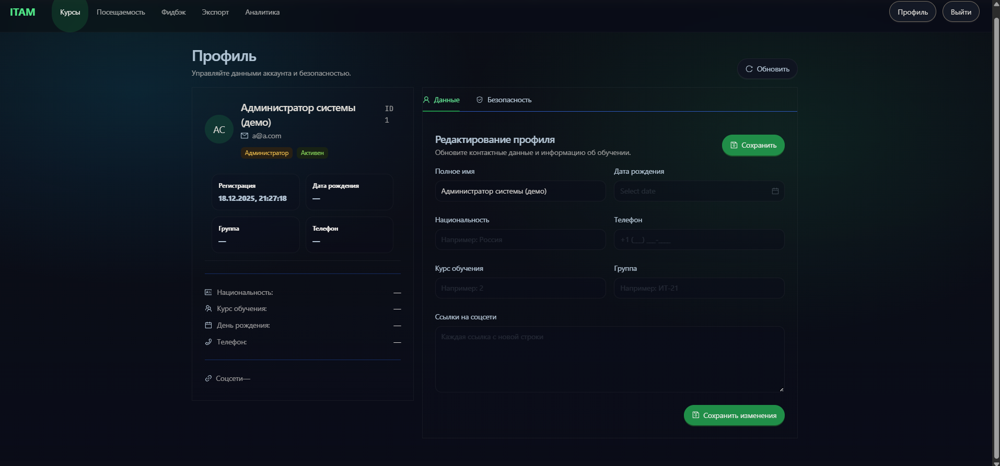
  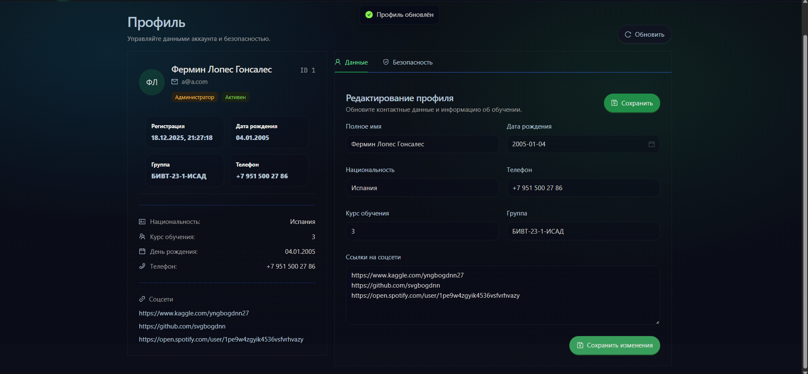
</p>

У каждого пользователя есть страница **Профиля**, где:
- отображаются личные данные (ФИО, email, группа, контакты и т.д.);
- при необходимости доступно редактирование разрешённых полей.

Типовой API для обновления профиля:
- `PATCH /api/v1/users/me`

### 🔒 Вкладка «Безопасность» (смена пароля)
Пользователь вводит текущий и новый пароль, затем отправляется запрос:
- `POST /api/v1/users/me/change-password`

Запрос выполняется только с авторизацией; сервер проверяет текущий пароль и сохраняет новый (в виде хеша). После успеха показывается уведомление.

📌 Доступ:
- пользователь управляет **своими** данными;
- администратор может иметь расширенные инструменты управления пользователями (роли, пароли и т.д.) через отдельные админ-эндпоинты.

---

## 📚 Курсы
<p align="center">
  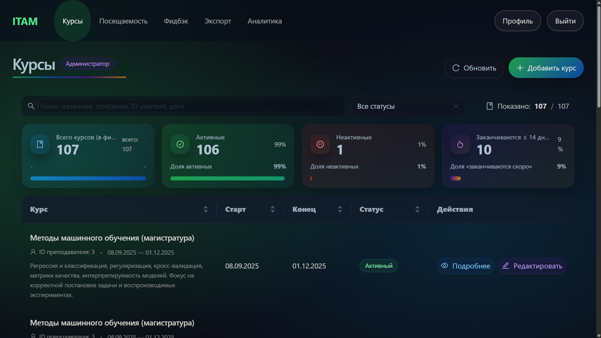
  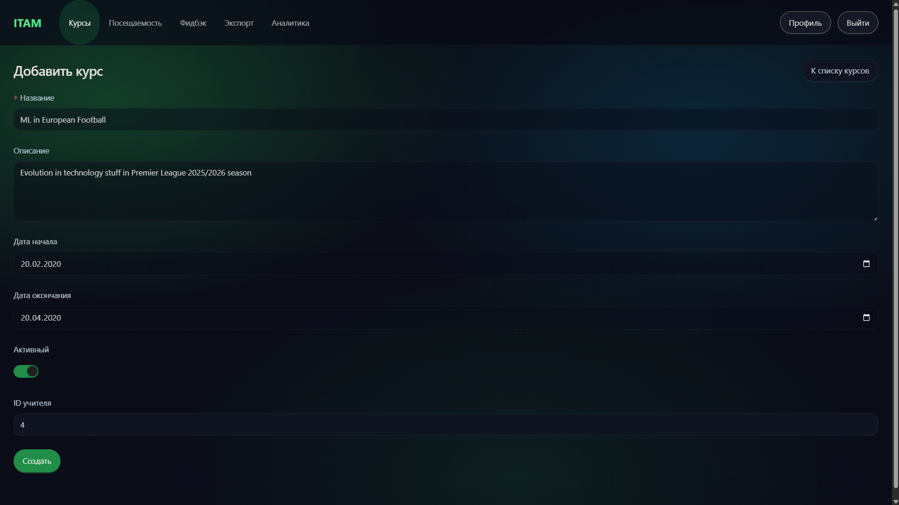
</p>
<p align="center">
  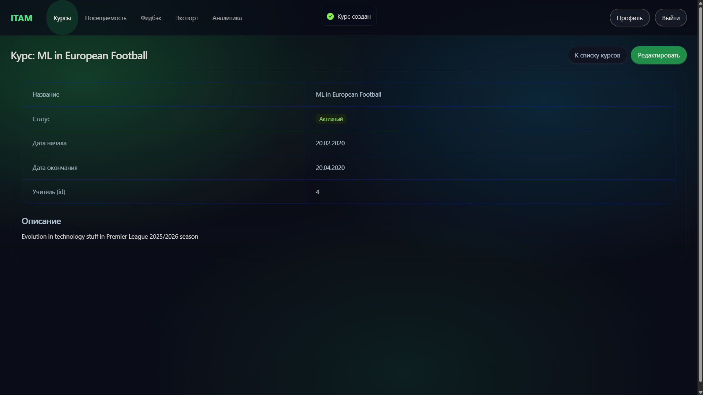
  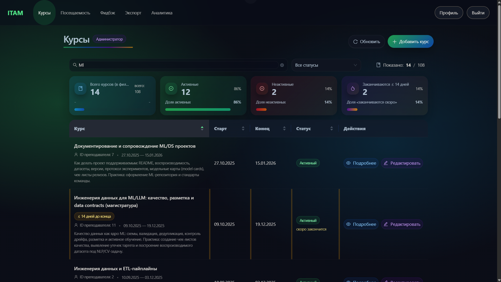
</p>

### 🧩 Роль модуля «Курсы»
Раздел **«Курсы»** — центральный CRUD-модуль, который задаёт «контейнер» учебной структуры:
- к курсу привязаны **уроки (занятия)**;
- через уроки связаны **посещаемость** и **фидбэк**;
- аналитика и экспорт обычно агрегируются **по курсам**.

---

### ✅ Функциональность раздела
Пользователь (обычно **Teacher** или **Admin**) может:
- просматривать список курсов в таблице;
- искать курс по названию;
- фильтровать по статусу (активные/архивные/все);
- видеть верхние метрики (например, количество курсов и т.п.);
- создавать новый курс;
- открывать детали курса;
- редактировать курс;
- (опционально) удалять курс — если разрешено политикой и правами.
- 
---

### 🗃 Модель данных «Курс»
Типовые поля:
- `id` — идентификатор
- `name/title` — название
- `description` — описание
- `start_date` — дата начала
- `end_date` — дата окончания
- `is_active` — активность
- `teacher_id` — ответственный преподаватель

Связи:
- **Курс → много уроков**
- **Урок → много записей посещаемости**
- **Урок → много записей фидбэка**

---

### 🔌 API для курсов
Примерный набор REST-эндпоинтов:
- `GET /api/v1/courses` — список (поиск, фильтры, пагинация)
  - `search/q` — поиск по названию/описанию
  - `is_active` — фильтр статуса
  - `skip/limit` или `page/page_size` — пагинация
- `GET /api/v1/courses/{id}` — конкретный курс
- `POST /api/v1/courses` — создать курс
- `PATCH /api/v1/courses/{id}` — обновить курс
- `DELETE /api/v1/courses/{id}` — удалить курс (если разрешено)

🔐 Все операции требуют авторизации:
- `Authorization: Bearer <token>`

---

### 🖥 Фронтенд: интерфейс курсов
На стороне клиента:
- страница списка обычно доступна по маршруту `/courses`;
- детали курса — `/courses/{id}`;
- создание курса может открываться в модальном окне (или отдельной странице — по реализации).

Для таблицы Ant Design важно:
- задавать `rowKey` для строк;
- корректно синхронизировать пагинацию/сортировку/фильтры с сервером через `onChange`;
- при смене фильтров логично возвращаться на первую страницу.

---

### ➕ Создание курса
Форма создания обычно включает:
- название
- описание
- дату начала
- дату окончания
- статус активности
- `teacher_id` (если создаёт администратор; у преподавателя может назначаться автоматически)

✅ Бэкенд должен валидировать:
- обязательность названия,
- корректность дат (`start_date <= end_date`),
- что `teacher_id` указывает на существующего преподавателя.

---

### ✏️ Редактирование курса
Редактирование выполняется через ту же форму, что и создание, но с предзаполненными значениями. После сохранения (`PATCH /api/v1/courses/{id}`) запись в таблице обновляется, пользователю показывается уведомление об успехе.

---

## 🗓️ Посещаемость
<p align="center">
  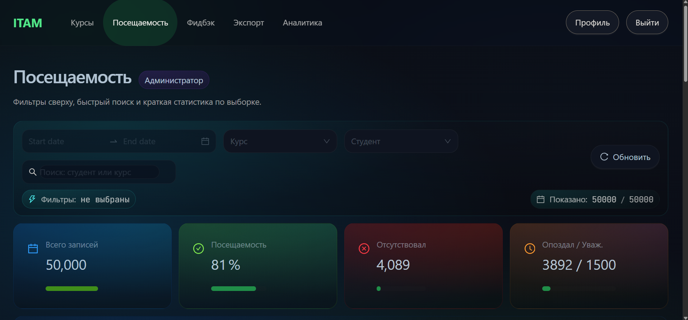
  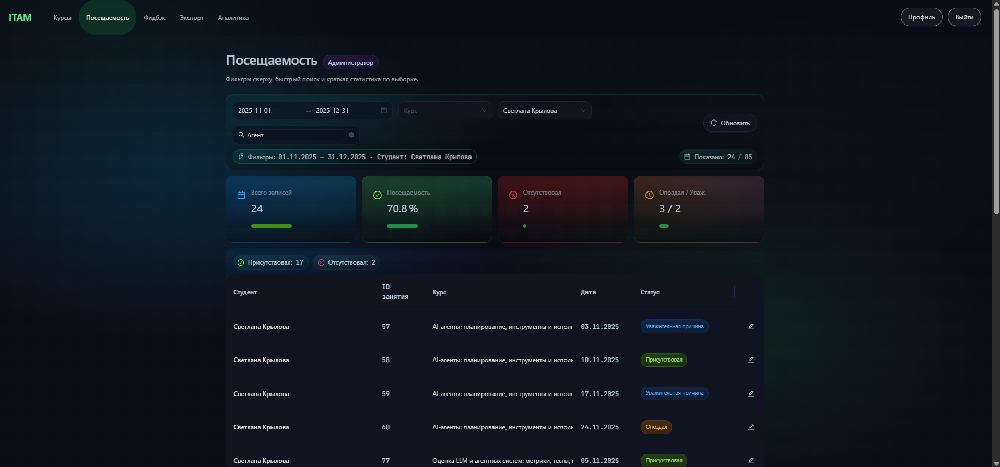
</p>
<p align="center">
  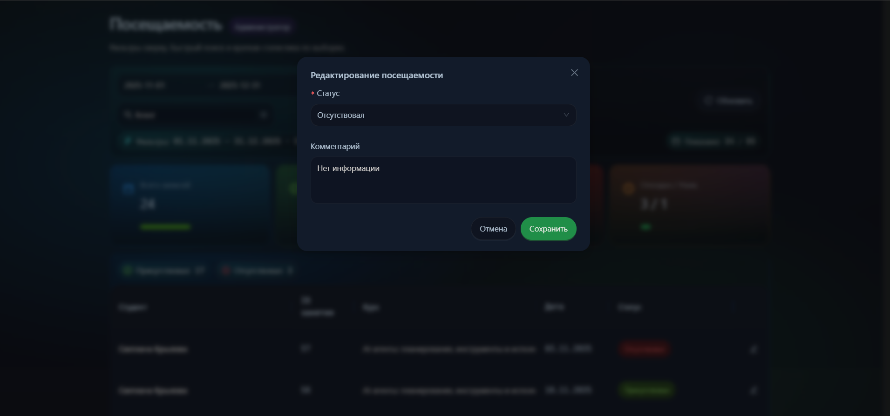
  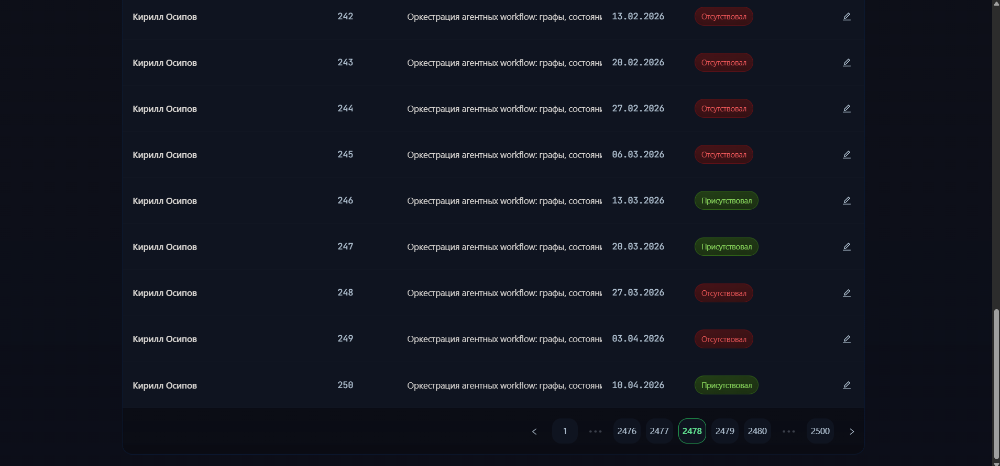
</p>

Страница **«Посещаемость»** предназначена для фиксации и контроля посещения студентов на занятиях. Она объединяет несколько сущностей:

- 📘 **Курс** — выбранный учебный курс
- 🗓️ **Урок / занятие** — конкретное занятие (имеет дату/аудиторию/тему)
- 👤 **Студент** — учащийся (пользователь с ролью `Student`)
- ✅ **Запись посещаемости** — отметка о присутствии/отсутствии студента на данном уроке (включает статус и, возможно, комментарий)

Таким образом, каждая запись посещаемости связывает студента с уроком определённого курса и фиксирует результат: например, **присутствовал**, **опоздал**, **отсутствовал** (возможно, с указанием причины).

С точки зрения архитектуры это типичный экран **«данные + фильтры + таблица + точечное редактирование»**, который работает поверх **REST API** и использует авторизацию по **Bearer-токену (JWT)** на backend.

### 👥 Сценарии использования

- 👑 **Администратор:** обозревает общую картину посещаемости по всем курсам и датам, ищет проблемные места (массовые пропуски, аномальные статусы), при необходимости вносит корректировки в данные (например, исправляет ошибочно введённые отметки) и проверяет целостность данных (особенно при заполнении демо-данными/после `seed`).
- 🎓 **Преподаватель:** ведёт страницу посещаемости как электронный журнал для своих курсов. Выбирает курс и диапазон дат, при необходимости фильтрует по конкретному занятию или студенту, отмечает присутствия/отсутствия, добавляет комментарии к отметкам (если предусмотрено функционалом).
- 👤 **Студент:** обычно имеет либо доступ только на просмотр своих записей, либо страница скрыта, а доступ реализован через «Профиль»/«Мои занятия». Правило доступа реализуется через **RBAC на backend** (зависимости текущего пользователя + проверки роли), при этом сам запрос защищён токеном.

🔐 **Правила доступа в модуле посещаемости обеспечиваются на уровне бэкенда:**
- администратор может работать с любой посещаемостью;
- преподаватель — только в рамках своих курсов (фильтрация происходит автоматически по токену);
- студент — только просматривает свои отметки.

---

### 🎛️ Интерфейс и фильтры

Ниже показан общий вид страницы посещаемости с включёнными фильтрами и результатами.

**Основные элементы интерфейса:**

- 🧰 **Панель фильтров (вверху страницы)** — задаёт контекст отображаемых данных. В типовой реализации присутствуют:
  - 📅 **Диапазон дат (DatePicker Range):** задаёт начало и конец периода, в пределах которого будут выбраны занятия (уроки).
  - 📘 **Курс (Select):** выбор курса. После выбора курса обычно логично «подгрузить» связанные сущности (уроки/студентов), чтобы остальные селекты были релевантными.
  - 🗓️ **Урок (Select, опционально):** выбор конкретного занятия (часто зависит от выбранного курса).
  - 👤 **Студент (Select с поиском, опционально):** фильтр по студенту (поиск по ФИО/почте для удобства).
  - 🏷️ **Статус (Select или группа кнопок):** фильтр по статусу посещения (например, показать только «отсутствия»). Удобно делать **мультивыбор**, если нужно отобразить несколько статусов.
  - 🔎 **Поиск (текстовый ввод):** быстрый поиск по полям записи (имя студента, тема урока, аудитория и т.п.).

- 📋 **Таблица результатов:** ниже фильтров отображается таблица, каждая строка которой представляет запись посещаемости. Колонки таблицы включают:
  - 🗓️ **Дата занятия**
  - 📘 **Курс**
  - 🏫 **Урок** (название/тема/аудитория)
  - 👤 **Студент** (ФИО)
  - 🏷️ **Статус** (цветной бейдж/тег, например зелёный «Присутствовал», красный «Отсутствовал» и т.д.)
  - 💬 **Комментарий** (при наличии)
  - ✏️ **Действия** (редактировать/сохранить)

- 📄 **Постраничная навигация (пагинация):** внизу таблицы — переключение страниц результатов и выбор размера страницы (число записей на страницу).

✅ **Для таблицы критично:**
- серверная пагинация (`page / page_size`);
- отображение общего `total`;
- сортировки/фильтры (если включены).

В Ant Design сортировки и фильтры обычно работают через обработчик `onChange`, который отдаёт `pagination / sorter / filters`, и это преобразуется в запрос к API.

---

### 🔄 Загрузка и обновление данных

Ниже — «сквозной» поток данных, соответствующий логике работы раздела:

1. 🚀 **Первичная загрузка страницы:** при открытии «Посещаемость» фронтенд параллельно запрашивает справочные данные для фильтров:
2. 📘 **Список курсов** (для выпадающего списка «Курс»).
3. 👥 При необходимости **список студентов** (например, если студент не привязан к курсу, или общий список для поиска). Таблица изначально может быть пустой (пока не выбран курс и период) либо загрузить данные за дефолтный диапазон (например, последние 7 дней).
4. 🎛️ **Применение фильтров:** когда пользователь выбирает курс, даты или другие фильтры, приложение обновляет внутреннее состояние (например, `selectedCourseId`, `dateRange` и т.п.), сбрасывает пагинацию на первую страницу и выполняет запрос к серверу за обновлёнными данными.
5. ⏳ Не следует дергать API на каждый ввод символа — текстовый поиск лучше подтверждать отдельной кнопкой или делать с небольшой задержкой (debounce).
6. 🌐 **Запрос GET к API:** фронтенд формирует запрос наподобие:

```http
GET /api/v1/attendance?date_from=2025-10-01&date_to=2025-10-31&course_id=12&lesson_id=55&student_id=1031&status=absent&page=1&page_size=50
````

Бэкенд возвращает:

```json
{
  "items": [
    { /* данные записи */ },
    "..."
  ],
  "total": 123
}
```

Где:

* `items` — список объектов посещаемости для таблицы,
* `total` — общее число записей, соответствующих фильтрам.

7. 🧾 **Отрисовка таблицы:** фронтенд кладёт массив `items` в `dataSource`, устанавливает `total` для компонента пагинации, отображает статус через `Badge/Tag` и показывает индикатор загрузки (spinning) на время запросов, чтобы пользователь видел, что идёт обновление.

---

### ✏️ Редактирование записей

Если пользователю разрешено изменять посещаемость (администратору или преподавателю), интерфейс предоставляет инструмент редактирования. Возможные варианты реализации:

* 🧩 inline-редактирование строки (сложнее),
* 🪟 модальное окно «Изменить статус» (проще и надёжнее),
* 📌 drawer-панель справа (комфортно для длинных комментариев).

Обычно можно изменить **статус посещения** и добавить/обновить **комментарий**.

После внесения изменений фронтенд отправляет запрос:

```http
PATCH /api/v1/attendance/12345
Content-Type: application/json

{
  "status": "late",
  "comment": "Опоздал на 10 минут"
}
```

На сервере:

* проверяется право текущего пользователя вносить изменения (только админ или преподаватель своего курса),
* валидируется допустимость перехода статусов (если правила есть),
* сохраняется результат.

Фронтенд после ответа:

* либо 🔄 перезапрашивает текущую страницу таблицы,
* либо ✅ делает «оптимистичное обновление» (локальный update) + fallback при ошибке.

---

### ⚙️ Технические детали бэкенда

В модуле посещаемости бэкенд реализует все перечисленные фильтры: можно запросить записи по диапазону дат, курсу, уроку, студенту и статусу. Результат отдаётся постранично, чтобы не перегружать клиент. Все эндпоинты требуют наличия JWT токена.

При реализации запросов важно оптимизировать доступ к данным: список посещаемости почти всегда требует `join`-ов, чтобы таблица сразу показывала «человеческие» поля — название курса, тему урока, ФИО студента, дату занятия. Опасность — **N+1 запрос**, когда для каждой строки отдельно подгружаются `lesson/student/course`. Правильная практика в SQLAlchemy — использовать eager loading (например, `selectinload`), чтобы уменьшить число запросов и стабилизировать время ответа на больших объёмах.

Для целостности данных рекомендуется обеспечить **уникальность записи посещаемости**: `(lesson_id, student_id)` должны быть уникальны, иначе «дубли» посещения ломают аналитику. Индексы по `lesson_id`, `student_id` (и при необходимости по дате) ускорят фильтрацию.

---

## 💬 Фидбэк (обратная связь)
<p align="center">
  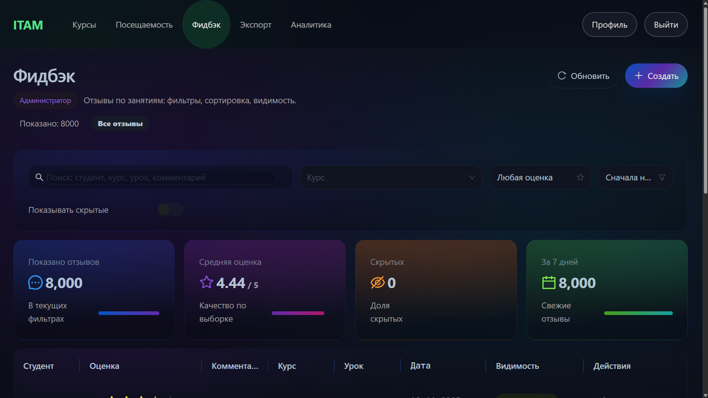
  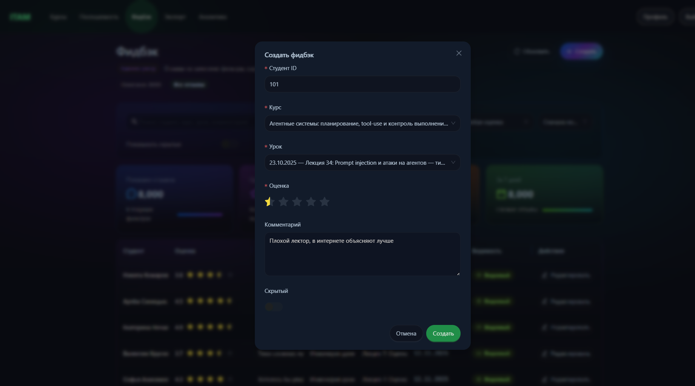
</p>
<p align="center">
  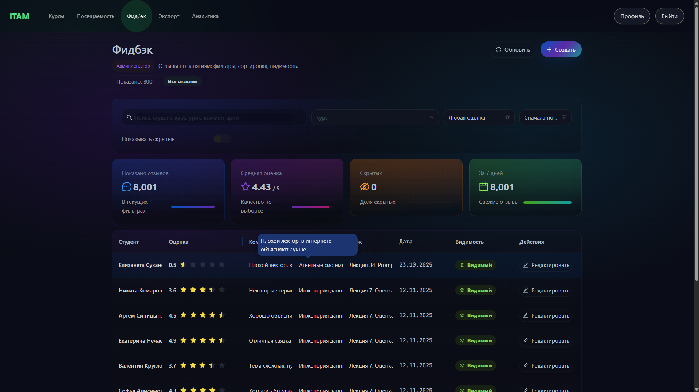
  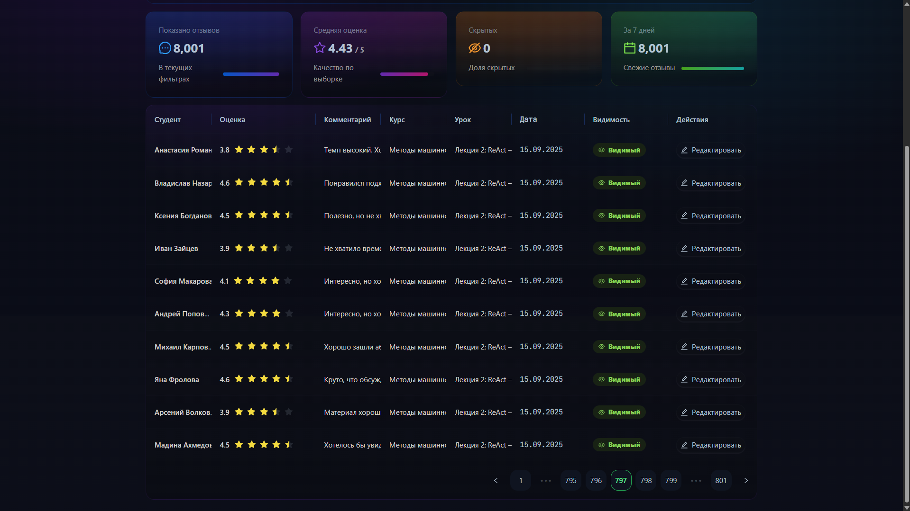
</p>

Раздел **«Фидбэк»** — административная страница для просмотра и управления отзывами студентов о занятиях. Здесь отображаются:

* ⭐ **оценки** (в виде звёзд),
* 📝 **комментарии**, оставленные студентами по итогам уроков.

Администратор может:

* 🔎 фильтровать отзывы,
* ↕️ сортировать,
* 🙈 помечать как скрытые/видимые,
* ➕ создавать записи вручную,
* ✏️ редактировать записи.

Интерфейс рассчитан на большие объёмы данных (тысячи записей) и использует **серверную пагинацию** для быстрой работы.

---

### 🎯 Возможности и сценарии

Основные задачи, которые решает раздел фидбэка:

* 📌 **Обзор всех отзывов** в одном месте с возможностью быстрого анализа (средняя оценка, количество отзывов и т.д.).
* 🔎 **Поиск конкретных отзывов** — фильтрация по студенту, курсу, конкретному уроку или ключевым словам в тексте.
* 🙈 **Управление видимостью** — скрытие нежелательных/некорректных отзывов от отображения (например, с ненормативной лексикой) и возможность их снова показать.
* ➕ **Добавление отзывов вручную** — например, при миграции данных или для демонстрации (администратор может внести отзыв от лица студента).
* ✏️ **Редактирование отзывов** — исправление оценок или текста (например, по результатам модерации или по просьбе студента) без непосредственного доступа к базе данных.

Типичный сценарий: администратор открывает страницу фидбэка, ставит фильтр по курсу и минимальной оценке, просматривает комментарии, скрывает неподходящие записи (с пометкой «скрыто»), при необходимости корректирует оценки/содержание, затем сохраняет изменения.

---

### 🎛️ Интерфейс: фильтры и метрики

В верхней части страницы расположены элементы управления:

* 🔄 **Кнопка обновления** («Обновить») — повторно загружает список отзывов с текущими фильтрами.
* ➕ **Кнопка создания** («Добавить») — открывает модальное окно для добавления нового фидбэка.

Ниже расположена **панель фильтров**, включающая:

* 🔎 **Поисковая строка** — текстовый поиск по имени студента, названию курса, уроку или содержимому комментария.
* 📘 **Селект курса** — выбор курса; ограничивает отзывы только данным курсом.
* ⭐ **Селект оценки** — выбор оценки (например, «Любая оценка», «Только 5 звёзд») для фильтрации по рейтингу.
* ↕️ **Селект сортировки** — выбор порядка сортировки (например, «Сначала новые»).
* 🙈 **Тумблер «Показывать скрытые»** — при включении показывает в таблице также отзывы, помеченные как скрытые (для администратора).

Практически это реализуется через контролируемые состояния + единый запрос на бэкенд с query-параметрами. Для таблиц Ant Design типовой паттерн — обрабатывать `onChange` таблицы и синхронизировать пагинацию/сортировку/фильтры с сервером.

---

### 📊 Быстрые метрики (карточки)

Под фильтрами отображаются KPI-карточки:

1. 📌 **Показано отзывов** — сколько записей в текущей выборке (после фильтров).
2. ⭐ **Средняя оценка** — агрегат по выборке.
3. 🙈 **Скрытых и доля скрытых** — модерационная метрика.
4. 🗓️ **За 7 дней** — «свежие отзывы» за неделю.

---

### 📋 Таблица отзывов

#### 5.1 Колонки

* 👤 **Студент**
* ⭐ **Оценка** (звёзды)
* 📝 **Комментарий** (в таблице укороченный; полный текст по hover/tooltip)
* 📘 **Курс**
* 🗓️ **Урок**
* 📅 **Дата**
* 👁️ **Видимость** (например, «Видимый»)
* ✏️ **Действия** → «Редактировать»

Для Ant Design таблицы нормальная реализация «tooltip по hover» — рендер ячейки с обрезкой + `Tooltip/Popover`.

#### 5.2 Пагинация и производительность

Пагинация рассчитана на тысячи записей и должна быть серверной:

* фронт хранит `page` и `pageSize`;
* при смене страницы запрашивает новые данные;
* сервер возвращает `items + total`.

Ant Design Table поддерживает серверный режим через `pagination` и `onChange`.

---

### 🪟 6) Создание отзыва (модалка)

**Поля:**

* 🆔 `Student ID` (обязательное)
* 📘 **Курс** (обязательное)
* 🗓️ **Урок** (обязательное)
* ⭐ **Оценка** (звёзды)
* 📝 **Комментарий** (`textarea`)
* 🙈 **Скрытый** (переключатель)
* ✅ Кнопки: **Отмена / Создать**

#### 6.1 Зависимости полей

Нормальная логика выбора:

1. выбирается курс;
2. список уроков фильтруется по курсу;
3. выбирается урок.

Это снижает риск создать отзыв «на урок не из того курса».

#### 6.2 Валидация

Типовой набор правил:

* `Student ID`: required, integer > 0
* `Course`: required
* `Lesson`: required
* `Rating`: required, диапазон 0.5 (или 1..5), допускаются дробные значения (в seed-данных встречаются 4.8 и т.п.)
* `Comment`: ограничение длины (например, 1..500/1000), запрет пустых строк, если поле required

В Ant Design это обычно делается через `Form` и `rules` у `Form.Item`.

#### 6.3 Оценка звёздами

Используется `Rate`:

* поддерживает дробные значения через `allowHalf` (если включено);
* допускает очистку значения через `allowClear` (по необходимости).

---

### 🪟 7) Редактирование отзыва (модалка)

Обычно редактируются:

* ⭐ оценка,
* 📝 комментарий,
* 🙈 флаг скрытости (видимость).

Кнопки: **Отмена / Сохранить**.

--- 

## 8. 🔌 Контракт API (логика взаимодействия фронт ↔ бэк)

### 8.1 📄 Получение списка

**Метод/эндпоинт:** `GET /api/v1/feedback`

**🔎 Query-параметры (типовой набор для UI):**

- **page, page_size** — пагинация
- **q** — поиск
- **course_id** — фильтр по курсу
- **rating** или **rating_min/rating_max** — фильтр по оценке
- **show_hidden** или **is_hidden** — показывать/фильтровать скрытые
- **sort** (например, **created_at_desc**) — сортировка

**📦 Ответ (структура):**

- **items** — массив записей (для таблицы)
- **total** — общее количество записей под фильтры (для серверной пагинации)

### 8.2 📊 Метрики

**Вариант A (рекомендованный):** отдельный эндпоинт агрегатов, чтобы не мешать таблицу и статистику:

- `GET /api/v1/feedback/metrics` (с теми же фильтрами)

**Пример ответа метрик:**

- shown_total
- avg_rating
- hidden_total
- last_7_days

**Вариант B:** возвращать метрики в ответе списка (как `meta`), но следить за кэшированием/нагрузкой.

### 8.3 ➕ Создание

**Метод/эндпоинт:** `POST /api/v1/feedback`

**Тело запроса (примерно):** `student_id`, `course_id`, `lesson_id`, `rating`, `comment`, `is_hidden`.

### 8.4 ✏️ Обновление

**Метод/эндпоинт:** `PATCH /api/v1/feedback/{id}`

**Тело запроса (частично):** `rating`, `comment`, `is_hidden`.

### 8.5 🔐 Авторизация запросов

Все запросы раздела должны уходить с заголовком:

```http
Authorization: Bearer <JWT>
````

Это соответствует стандартной схеме Bearer-токена через `Authorization` header. ([IETF Datatracker][1])

---

## 9. 🗄️ Модель данных (что хранится)

Минимально необходимые поля для таблицы отзывов:

* id
* student_id (FK на users)
* lesson_id (FK на lessons)
* rating (float)
* comment (text)
* is_hidden (bool)
* created_at (datetime)

**⚡ Производительность (индексы):**

* (lesson_id), (student_id), (created_at), (is_hidden), возможно (rating)

**🔎 Поиск по comment:**

* либо ILIKE (дороже),
* либо полнотекстовый индекс PostgreSQL (когда реально понадобится).
  Для полнотекста обычно используют `tsvector` + GIN/GiST индексы. ([PostgreSQL][2])

---

## 📤 Экспорт данных
<p align="center">
  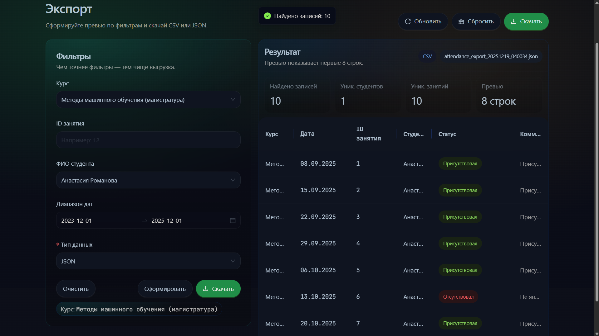
  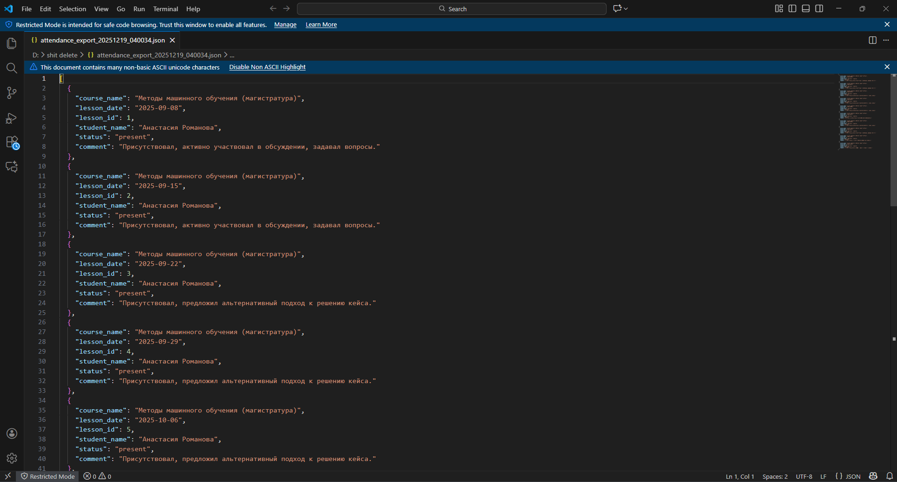
</p>

Раздел **«Экспорт»** позволяет выгрузить накопленные данные о посещаемости в файл для дальнейшего анализа или отчётности. Поддерживаются форматы **CSV** (например, для Excel/Google Sheets) и **JSON** (для программной обработки). Перед скачиванием можно настроить фильтры и увидеть **превью** выгрузки прямо в интерфейсе.

---

### 🧭 Сценарий экспорта

Обычный процесс работы:

1. Открыть раздел **«Экспорт»** (форма фильтров + выбор формата).
2. Указать фильтры:

   * минимум — **курс** (чтобы ограничить объём выгрузки),
   * дополнительно — **урок**, **студент**, **диапазон дат**,
   * выбрать формат: **CSV** или **JSON**.
3. Нажать **«Сформировать»** → приложение отправляет запрос на сервер, после чего на странице появляется **превью** (первые *N* строк) и информация о том, **сколько всего** записей попадёт в файл.
4. Нажать **«Скачать»** → браузер начинает загрузку файла (имя формируется автоматически, обычно с датой/временем формирования).
5. (Опционально) **«Очистить»** → сброс фильтров и превью, чтобы сформировать выгрузку заново для других параметров.

---

### 🧾 Форматы файлов

* **CSV** — текстовый файл с разделителями: первая строка содержит **заголовки колонок**, далее идёт **по одной строке на запись** посещаемости. Удобен для Excel/Sheets.
* **JSON** — массив объектов, где каждая запись посещаемости представлена отдельным объектом с полями (студент, курс, дата, статус и т.д.). Удобен для интеграций и скриптов.

---

### ⚙️ Техническая реализация экспорта

Есть два типовых подхода (в проекте можно использовать любой из них — или комбинировать):

**Вариант 1: сервер формирует файл и отдаёт как вложение**
Сервер возвращает ответ с заголовком `Content-Disposition: attachment; filename="..."`, и браузер скачивает файл с указанным именем. Это стандартная практика для “файловых” ответов. ([IETF HTTP Working Group][1])
В FastAPI для отдачи файлов и больших выгрузок обычно используют `FileResponse` или `StreamingResponse` (второй вариант удобен, когда нужно стримить данные и не держать всё в памяти). ([FastAPI][2])

**Вариант 2: формирование файла на клиенте**
Сервер отдаёт данные в JSON, а фронтенд локально формирует CSV/JSON и инициирует скачивание через `Blob` и `URL.createObjectURL()`. ([MDN Web Docs][3])
(В таком варианте превью обычно делать проще, потому что те же данные используются и для таблицы на странице.)

---

### 🔐 Разграничение доступа

Экспорт защищён авторизацией и ролями (RBAC):

* **Admin** — может экспортировать данные по любым курсам и студентам.
* **Teacher** — только по своим курсам/занятиям.
* **Student** — (если предусмотрено) только свои данные.

[1]: https://httpwg.org/specs/rfc6266.html?utm_source=chatgpt.com "RFC 6266 - Use of the Content-Disposition Header Field in the ..."
[2]: https://fastapi.tiangolo.com/advanced/custom-response/?utm_source=chatgpt.com "Custom Response - HTML, Stream, File, others - FastAPI"
[3]: https://developer.mozilla.org/en-US/docs/Web/API/URL/createObjectURL_static?utm_source=chatgpt.com "URL: createObjectURL() static method - Web APIs | MDN"

---

## 📊 Аналитика (метрики и прогнозы)
<p align="center">
  
  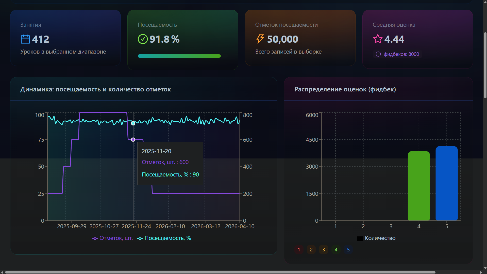
</p>
<p align="center">
  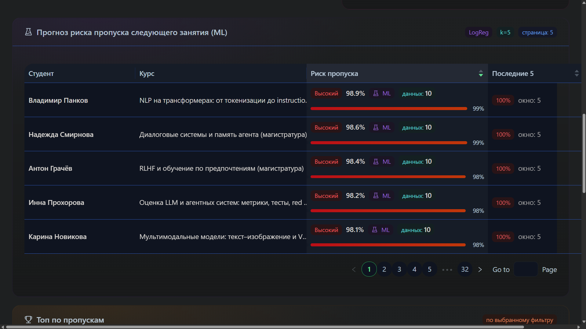
  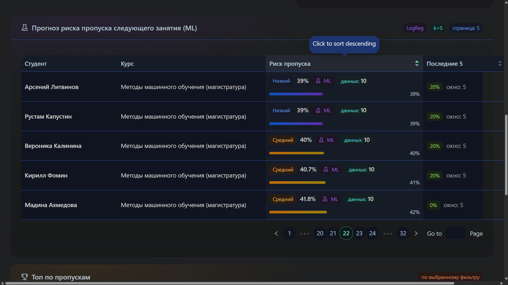
</p>
<p align="center">
  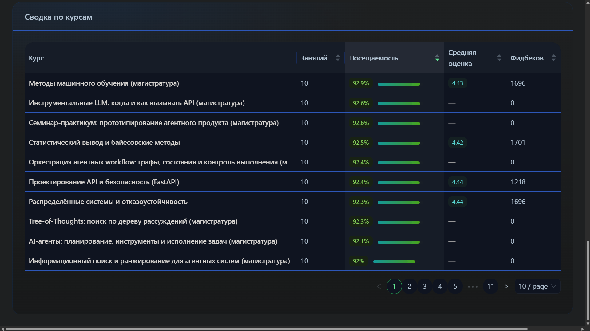
  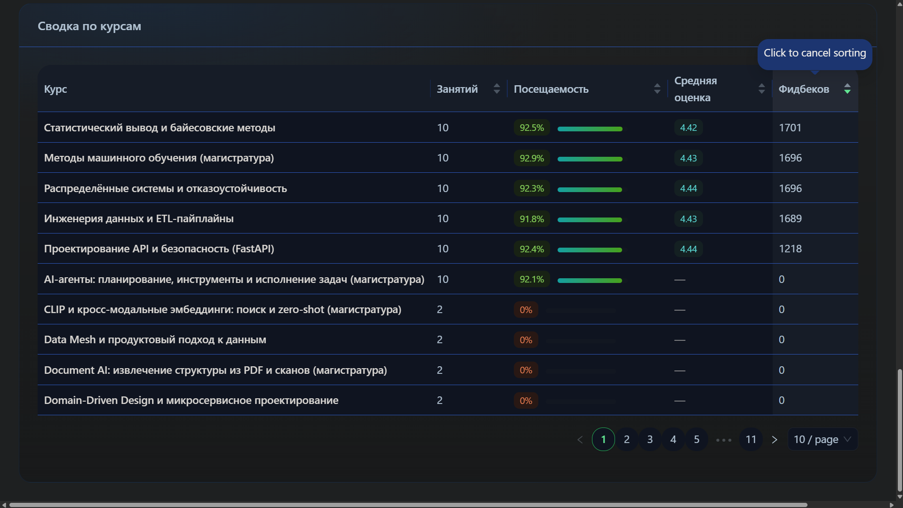
</p>
<p align="center">
  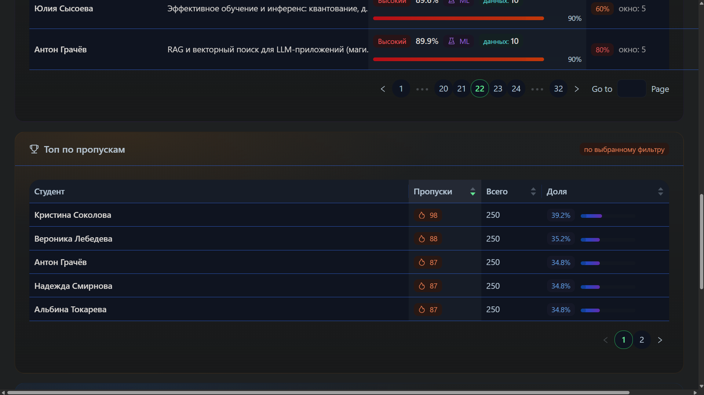
  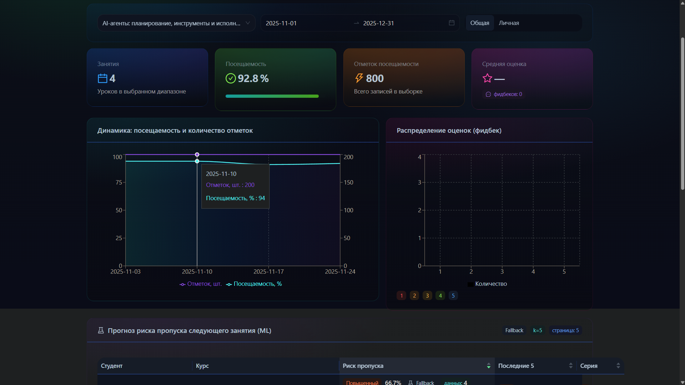
</p>

Раздел «Аналитика» — центр отслеживания ключевых показателей успеваемости и посещаемости. Здесь данные из разных модулей объединяются, чтобы показать сводные метрики, тренды и прогнозы (включая прогноз риска пропуска следующего занятия на основе ML-модели).


[1]: https://datatracker.ietf.org/doc/html/rfc6750 "RFC 6750 - The OAuth 2.0 Authorization Framework"
[2]: https://www.postgresql.org/docs/current/textsearch-indexes.html "18: 12.9. Preferred Index Types for Text Search"
[3]: https://fastapi.tiangolo.com/advanced/custom-response/ "Custom Response - HTML, Stream, File, others - FastAPI"
---

### 🎛️ Фильтры и режимы анализа

В верхней панели раздела аналитики можно выбрать параметры, которые определяют контекст всех метрик:

1. **Фильтр курса**  
   Позволяет переключить отображение либо на один конкретный курс, либо (если не выбрано ничего) агрегировать данные по всем курсам, доступным пользователю.  

2. **Диапазон дат**  
   Ограничивает период, за который собираются данные. Например, можно анализировать посещаемость за последний месяц или за весь семестр.

3. **Scope (режим общей или личной аналитики)**  
   Переключатель, определяющий, чьи данные агрегируются:
   - **Общая аналитика** — метрики по всем студентам (в пределах выбранных курсов и с учётом ролей пользователя).
   - **Личная аналитика** — статистика для конкретного пользователя (чаще всего студент видит только себя; преподаватель/администратор — зависит от правил проекта).

---

### 📌 KPI-показатели

В верхней части страницы отображаются несколько крупных чисел — основные KPI. В проекте они включают, например:

- **Количество занятий** — сколько уроков прошло за выбранный период (и, если выбран курс — по этому курсу).
- **Количество отметок посещаемости** — общее число записей посещаемости в выборке (все “присутствовал/отсутствовал” за период).
- **Процент посещаемости** — доля присутствий от общего числа отметок; обычно считается как:  
  `(количество присутствий / общее количество отметок) * 100%`
- **Средняя оценка фидбэка** — средний балл, который ставят студенты за занятия в выбранном диапазоне.
- **Количество отзывов** — сколько всего комментариев/оценок было оставлено студентами.

Эти показатели дают быстрый обзор ситуации: за секунды видно, сколько было уроков, насколько хорошо студенты посещали занятия и как оценивали курс.

---

### 📈 График динамики посещаемости

Один из ключевых блоков — график по датам занятий, показывающий изменение процента посещаемости и/или количества студентов на занятиях во времени.

- По горизонтали — даты уроков.
- По вертикали — процент присутствующих (линия) и, например, общее число студентов (столбики).

Такой график помогает увидеть тренды: есть ли спад посещаемости к концу семестра, были ли резкие провалы (например, из-за праздников или других событий) или наоборот рост вовлечённости.

Анализ динамики позволяет выявлять аномалии. Например:

- Резкое падение процента посещаемости в определённую неделю — сигнал возможной проблемы (сложная тема, неудобное время занятий и т.д.).
- Если количество отмеченных студентов меняется скачкообразно — возможно, менялось расписание или состав группы.

---

### ⭐ Распределение оценок

Этот блок показывает, как распределились оценки студентов в отзывах. Обычно это столбчатая диаграмма:

- Ось X — градации оценок (1 звезда, 2 звезды, … 5 звёзд)
- Ось Y — количество таких оценок

Распределение помогает оценить общее восприятие курса:

- Если большинство отзывов — 4–5 звёзд, курс высоко оценивается.
- Если много низких оценок (1–2 звезды), вероятны проблемы в содержании курса или качестве преподавания.
- Если график “двугорбый” (много высоких и много низких, мало средних), аудитория воспринимает курс неравномерно (разный уровень подготовки, спорный формат и т.д.).

---

### 🚫 Топ пропусков

В этом блоке показываются студенты, которые чаще всего отсутствовали на занятиях за выбранный период. Обычно это таблица с колонками: студент + количество пропусков (или процент пропущенных занятий).

“Топ пропусков” помогает быстро выделить группу риска — тех, кому стоит уделить внимание. Преподаватель может связаться со студентами адресно, а администратор — заметить системные проблемы (например, если в одном курсе стабильно высокие пропуски).

---

### 📋 Сводка по курсам

В сводной таблице каждая строка — это курс, а столбцы — ключевые метрики курса за выбранный период. Обычно включаются:

- Название курса
- Число проведённых занятий
- Число отметок посещаемости (сколько записей всего собрано)
- Средний процент посещаемости по курсу
- Число полученных отзывов
- Средняя оценка (рейтинг) по курсу

Такая таблица позволяет сравнить курсы между собой: где посещаемость самая высокая, где ниже нормы, и где студенты активнее оставляют обратную связь.

---

### 🤖 ML-прогноз пропусков (прогноз риска отсутствия)

Особенность ITAM — блок с предсказаниями на основе машинного обучения. Цель модели — оценить вероятность того, что студент пропустит следующее занятие, то есть выделить потенциальную “группу риска”.

**Как устроена логика (на уровне смысла):**

- Модель обучена на исторических данных посещаемости.
- Для каждого студента анализируется последовательность отметок (присутствий/пропусков) за предыдущие занятия курса.
- На основе паттернов формируется прогноз на следующий урок. Пример: если студент пропустил 2 из последних 5 занятий — вероятность следующего пропуска может быть повышенной.

В реализации может использоваться “классический” алгоритм, например логистическая регрессия, которая выдаёт вероятность в диапазоне 0…1 и хорошо подходит для табличных признаков. ([Christoph Molnar][1])

**Важно:**

- Если по студенту недостаточно данных (например, курс только начался), система может показывать специальную пометку или режим “по умолчанию” — вместо уверенного прогноза.
- Блок прогнозов — дополнительный инструмент: он не гарантирует 100% точности, но помогает заранее выделить потенциально проблемных студентов для более пристального внимания.

---

## 🧩 Технологический стек и архитектура

Проект ITAM построен по классической схеме “клиент–сервер” с разделением на фронтенд и бэкенд. Ниже — основные компоненты и их взаимодействие.

### Компоненты системы

- **Frontend:** SPA на React + TypeScript. Отвечает за интерфейс (Курсы, Посещаемость, Фидбэк, Экспорт, Аналитика, Профиль, а также страницы входа/регистрации) и отправку запросов к серверу. UI-компоненты — Ant Design.
- **Backend:** REST API на FastAPI (Python). Реализует бизнес-логику, обработку HTTP-запросов, валидацию данных, авторизацию, работу с БД. Разбит на модули/роутеры.
- **Database:** PostgreSQL. Схема данных описана через ORM (SQLAlchemy), миграции — Alembic.
- **Docker-контейнеры:** для упрощения развёртывания фронтенд и бэкенд могут быть упакованы в Docker-образы и запускаться в контейнерах.

### Взаимодействие фронтенда и бэкенда (типовой цикл)

1. Пользователь открывает страницу (например, “Курсы”).
2. React-приложение отправляет запрос к API, например `GET /api/v1/courses`.
3. Бэкенд валидирует параметры, читает данные из БД через ORM и возвращает JSON.
4. Фронтенд получает JSON, сохраняет данные в состоянии и отрисовывает таблицу/карточки, применяет фильтры/сортировку, показывает статистику.

Этот цикл повторяется для фильтрации, переходов по страницам и любых действий пользователя: фронт запрашивает данные, бэк обеспечивает безопасную выдачу.

---

## 🛠️ Основные технологии бэкенда

- **FastAPI** — создание REST API, декларативные эндпоинты, валидация, зависимости, автодокументация (OpenAPI/Swagger).
- **Uvicorn** — ASGI-сервер (в dev часто с `--reload`).
- **SQLAlchemy (ORM)** — модели в `backend/app/models`, схемы (Pydantic) в `backend/app/schemas`, работа с данными без ручного SQL.
- **Alembic** — миграции в `backend/alembic/versions`, применение через `alembic upgrade head`.
- **Авторизация и безопасность** — JWT-токены, OAuth2PasswordBearer, зависимости для проверки ролей; CORS через CORSMiddleware.

---

## 🖥️ Основные технологии фронтенда

- **React + TypeScript** — компонентный интерфейс и строгая типизация (пропсы/стейт/API-ответы).
- **Vite** — быстрый dev-сервер и сборка; переменные окружения с префиксом `VITE_`.  
  Пример: `VITE_API_URL` (по умолчанию [http://localhost:8000/api/v1](http://localhost:8000/api/v1)).
- **Ant Design (AntD)** — UI-компоненты (таблицы, формы, модалки, меню, уведомления), единый стиль админ-панели; возможна настройка темы через `ConfigProvider`.
- **State Management (опционально)** — Redux/Zustand/Context API (в зависимости от реализации), для фильтров, текущего пользователя и т.д.

---

## 🐳 Docker и CI/CD

- В репозитории есть Docker-конфигурации для сборки образов фронтенда и бэкенда (например, `backend/Dockerfile` для установки зависимостей и запуска Uvicorn).
- Настроена автоматическая сборка образов через GitHub Actions (workflow `.github/workflows/publish-images.yml`) и публикация в GHCR (GitHub Container Registry), что позволяет быстро развернуть проект, подтянув готовые образы.

---

## 🗂️ Структура репозитория

Проект разделён на две основные директории:

- `backend/` — сервер FastAPI
- `frontend/` — React-клиент

**Ключевые директории/файлы:**

- `backend/app/api/v1/` — эндпоинты API по доменам: `auth.py`, `users.py`, `courses.py`, `lessons.py`, `attendance.py`, `feedback.py`, `export.py`, `analytics.py` и др. (всё подключено к `/api/v1`).
- `backend/app/core/` — конфигурация, подключение к БД, безопасность, CORS и т.п.
- `backend/app/models/` — ORM-модели таблиц (User, Course, Lesson, Attendance, Feedback и т.д.).
- `backend/app/schemas/` — Pydantic-схемы запросов/ответов.
- `backend/alembic/` — миграции (`versions`) и `alembic.ini`.
- `frontend/src/pages/` — страницы приложения (Courses, Attendance, Feedback, Export, Analytics, Profile, Login, Register).
- `frontend/src/api/` — функции для обращения к API (login(), getCourses() и т.п.), настройка HTTP-клиента (baseURL, интерцепторы).
- `frontend/src/config/` — конфигурация фронта, переменные окружения, константы.

---

## ▶️ Запуск и развертывание

Проект можно запустить двумя способами:

1. Локально (для разработки)
2. В Docker-контейнерах (для унифицированного окружения/деплоя)

### Локальный запуск (dev)

#### 1) Клонировать репозиторий и перейти в папку проекта

```bash
git clone <https://github.com/svgbogdnn/admin-panel>
cd admin-panel
````

#### 2) Запуск бэкенда

* Убедиться, что установлен Python 3.10+ (или версия из `backend/pyproject.toml`).
* Перейти в `backend/` в Первом терминале (лучше иметь параллельно как минимум 2 терминала, один для запуска бэкенда - второй для фронтенда, у меня даже был и третий для работы с гитом):

```bash
cd backend
```

* Создать и активировать виртуальное окружение:

```bash
python -m venv .venv
source .venv/bin/activate  # Linux/Mac
.venv\Scripts\activate     # Windows
```

* Установить зависимости:

```bash
pip install -r requirements.txt
```

* Настроить подключение к БД (например, через переменную окружения `DATABASE_URL`).
* 
* Применить миграции:

```bash
alembic upgrade head
```

* (Опционально) заполнить демо-данными через `bigseed.py` (если он есть):

```bash
python bigseed.py #or seed.py but there's smaller amount of data
```

* Запустить сервер FastAPI:

```bash
uvicorn app.main:app --reload --host 0.0.0.0 --port 8000 #в будущем просто uvicorn app.main:app --reload
```

После запуска:

* Бэкенд: [http://localhost:8000](http://localhost:8000)
* Swagger: [http://localhost:8000/docs](http://localhost:8000/docs)
* API-ручки: с префиксом `/api/v1`

#### 3) Запуск фронтенда

* Убедиться, что установлен Node.js 18+
* Перейти в `frontend/`:

```bash
cd frontend #если в новом терминале
```

* Установить зависимости:

```bash
npm install
```

* Настроить адрес API (Vite env): создать `frontend/.env.local` и указать:

```env
VITE_API_URL=http://localhost:8000/api/v1
```

* Запустить dev-сервер:

```bash
npm run dev
```

* Открыть приложение (обычно): [http://localhost:5173](http://localhost:5173)

### Проверка работы и диагностика

Если что-то не работает:

* Проверьте консоль разработчика (Network/CORS).
* Убедитесь, что API URL совпадает (`VITE_API_URL`).
* Посмотрите логи бэкенда (терминал с uvicorn) на предмет ошибок.

---

## 🐳 Сбор проекта с помощью Docker

1. Собрать образ бэкенда и фронтенда

```bash
docker build -t admin-panel ./backend
docker build -t admin-panel ./frontend
```

2) Проверить, что образы собрались

```bash
docker images | grep itam-
```

3) Собрать через Compose

```bash
docker compose build
```

---

## 🐳 Запуск с помощью Docker

Это можно сделать двумя способами - 

**1 (через GHCR)** 

```bash
docker login ghcr.io

docker pull ghcr.io/svgbogdnn/admin-panel-backend:latest
docker pull ghcr.io/svgbogdnn/admin-panel-frontend:latest

docker run --rm --name admin-panel-backend -p 8000:8000 ghcr.io/svgbogdnn/admin-panel-backend:latest   # ctrc+c to stop it
docker run --rm --name admin-panel-frontend -p 5173:5173 ghcr.io/svgbogdnn/admin-panel-frontend:latest # ctrc+c to stop it

docker exec -it admin-panel-backend python -c "from app.core.bigseed import seed; seed()"
```

**2 (через compose)**

```bash
docker login ghcr.io

docker pull ghcr.io/svgbogdnn/admin-panel-backend:latest  # stop below
docker pull ghcr.io/svgbogdnn/admin-panel-frontend:latest # stop below

docker compose up -d
docker compose exec backend python -m app.core.bigseed

docker system df #сколько места докер компоуз и конкретно что занимает
docker compose stop
docker compose down
```

[1]: https://christophm.github.io/interpretable-ml-book/logistic.html "7 Logistic Regression – Interpretable Machine Learning"